# Windows Deleted Evidence & Anti-Forensics Investigation

**Case ID:** DFIR-2026-001  
**Platform:** Windows 11 Pro virtual machine  
**Primary tools:** VMware Workstation Pro, FTK Imager, Autopsy 4.22.1, Microsoft Sysinternals SDelete  
**Examiner:** Brian Holder

> **Training lab notice:** This project uses only harmless simulated evidence. No illegal or contraband material was used. Suspicious filenames and activity were created solely to reproduce a law-enforcement-style deleted-evidence workflow in a safe lab environment.

## Objective

This lab simulated the forensic examination of a seized Windows computer after a user attempted to delete and overwrite evidence. The goal was to determine what could still be recovered, identify artifacts showing that deleted files previously existed, and reconstruct activity surrounding the use of a secure-deletion utility.

## Skills Demonstrated

- Preservation of a powered-off VMware evidence source
- Master/working copy separation
- SHA-256 manifest comparison between master and working evidence sets
- VMware snapshot-chain identification
- Forensic image creation and verification with FTK Imager
- E01 acquisition and integrity verification
- NTFS and Windows Recycle Bin examination
- Recovery of deleted file contents and deletion metadata
- Windows `.lnk` / Recent Activity analysis
- Browser history and download analysis
- Windows Prefetch analysis to corroborate program execution
- Anti-forensics investigation involving Sysinternals SDelete
- Timeline reconstruction and evidence-based reporting

## Scenario

A Windows 11 system was prepared with harmless training files, including images and text documents. The simulated user then performed several types of deletion:

1. Normal deletion to the Windows Recycle Bin
2. Shift+Delete deletion
3. Deletion followed by removal from the Recycle Bin
4. Secure overwrite of a controlled test file using SDelete

The system was then shut down, preserved, imaged, and examined as if it were seized evidence.

## Evidence Handling Workflow

1. Shut down the suspect VM and stopped all further user activity.
2. Preserved the complete VMware directory as `DFIR-Suspects-PC_MASTER`.
3. Generated SHA-256 hashes for every file in the master evidence directory.
4. Created a separate working copy for examination.
5. Hashed the working copy and compared relative paths and hashes against the master copy; no differences were returned.
6. Identified `DFIR-Suspects-PC-000003.vmdk` as the active final snapshot in the VMware chain.
7. Loaded the final snapshot in FTK Imager.
8. Created `DFIR_Suspect_Final.E01` and verified the image. FTK reported matching MD5 and SHA-1 verification hashes with no bad blocks.
9. Loaded the verified E01 into Autopsy for artifact extraction, deleted-file examination, and timeline analysis.

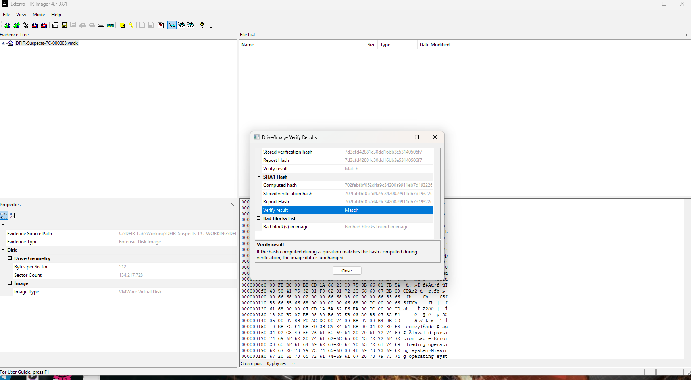

## Key Findings

### 1. Recycle Bin deletion remained recoverable

FTK Imager identified the Windows `$I` metadata record associated with `collection_001.png`. The metadata preserved the original path:

`C:\Users\Suspect\Documents\CaseFiles\Private\collection_001.png`

The matching `$R` file still contained the original harmless training image and could be previewed successfully.

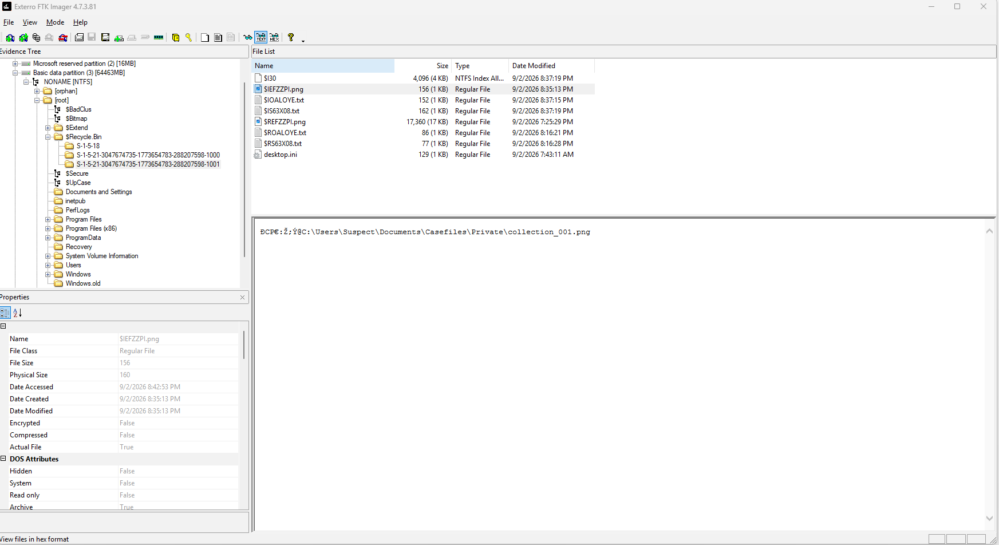

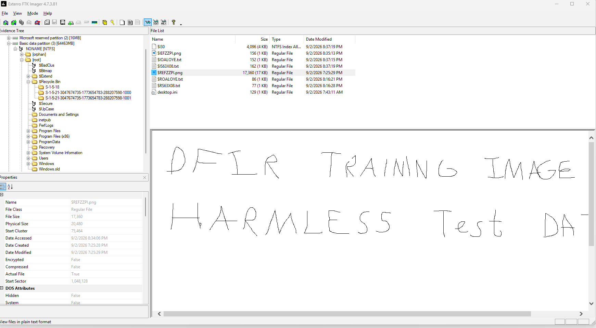

Autopsy identified exact Recycle Bin deletion timestamps:

| File | Time Deleted (CDT) |
|---|---:|
| `collection_001.png` | 2026-09-02 15:35:13 |
| `cleanup_plan.txt` | 2026-09-02 15:37:15 |
| `meeting_locations.txt` | 2026-09-02 15:37:19 |

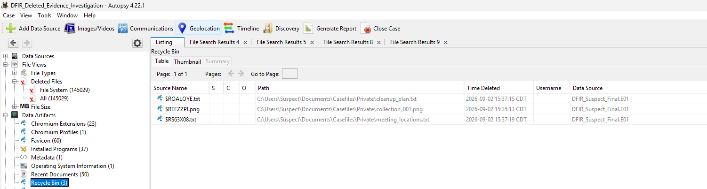

### 2. Shift+Deleted files left corroborating artifacts

Filename searches did not recover the original `collection_002.png` or `archive_password.txt` during the examination steps performed. However, Windows shortcut/recent-file artifacts referenced their original paths, establishing prior existence and access.

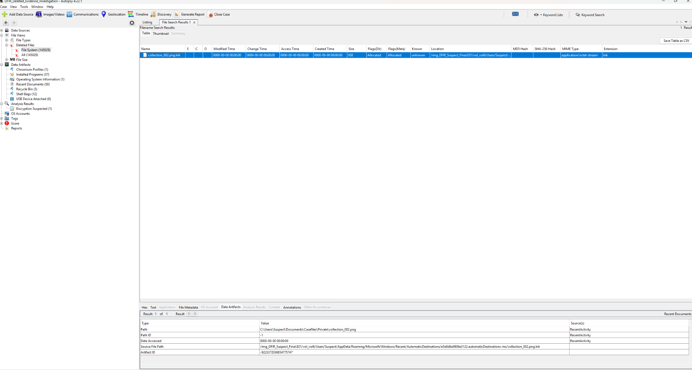

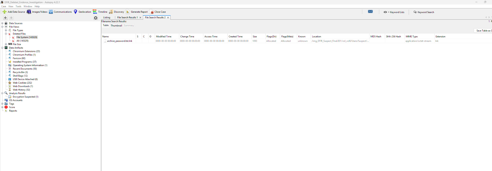

### 3. A file removed from the Recycle Bin still left traces

Autopsy located two `.lnk` artifacts referencing `collection_003.png` even though the original PNG was not returned by normal filename search.

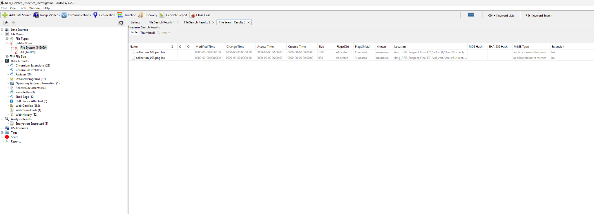

### 4. SDelete download and execution were corroborated

Autopsy Web Downloads showed `SDelete.zip` downloaded from Microsoft Sysinternals to the Suspect account's Downloads folder at **2026-09-02 15:50:05 CDT**. Zone.Identifier artifacts also existed for the extracted SDelete executables.

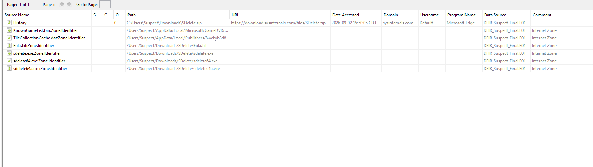

Windows Prefetch contained:

`SDELETE64.EXE-A89339E6.pf`

This provided evidence that `sdelete64.exe` was executed rather than merely downloaded.

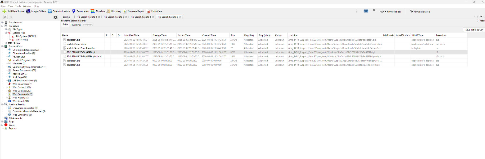

### 5. Securely deleted test content was not recovered

Two `.lnk` artifacts referenced `wipe_test.txt`, demonstrating that the file previously existed and had been accessed.

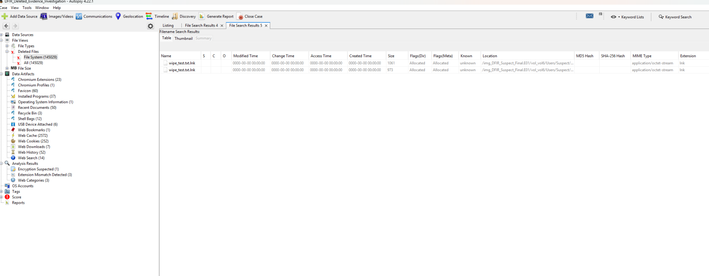

The original `wipe_test.txt` was not recovered through filename search. A keyword search for its distinctive marker, `DFIR_WIPE_TEST_2026`, returned no results. These observations are **consistent with the controlled file contents having been overwritten by SDelete**. This conclusion is intentionally phrased as an inference from the artifacts rather than an absolute claim.

### 6. Browser activity preceded secure deletion

Browser history showed repeated searches involving deleted-file recovery, permanent deletion, Recycle Bin behavior, secure deletion, and whether police could recover deleted files shortly before SDelete was downloaded and executed.

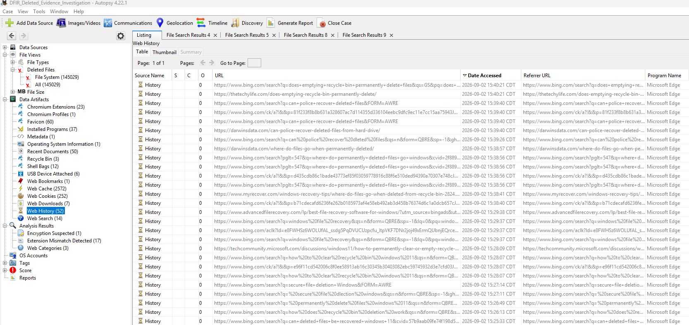

## Reconstructed Timeline

| Approx. Time (CDT) | Activity | Artifact Source |
|---|---|---|
| ~15:25 | Research into whether deleted files can be recovered | Edge Web History |
| ~15:26-15:27 | Research into permanent/secure deletion | Edge Web History |
| ~15:28 | Recycle Bin clearing and Windows file recovery research | Edge Web History |
| 15:35:13 | `collection_001.png` deleted to Recycle Bin | Autopsy Recycle Bin |
| 15:37:15 | `cleanup_plan.txt` deleted to Recycle Bin | Autopsy Recycle Bin |
| 15:37:19 | `meeting_locations.txt` deleted to Recycle Bin | Autopsy Recycle Bin |
| ~15:38-15:40 | Research into permanent deletion and police recovery | Edge Web History |
| 15:50:05 | `SDelete.zip` downloaded from Sysinternals | Autopsy Web Downloads |
| ~15:50 | SDelete files extracted | Filesystem / Zone.Identifier artifacts |
| ~15:51:50 | `SDELETE64.EXE` executed | Windows Prefetch |
| Examination | `wipe_test.txt` original not recovered; `.lnk` traces survived | Autopsy File Search |
| Examination | `DFIR_WIPE_TEST_2026` returned no keyword hits | Autopsy Keyword Search |

## Conclusion

The examination demonstrated that deletion does not necessarily eliminate evidence of a file's prior existence or user interaction with it. A file deleted to the Recycle Bin remained recoverable with both original content and deletion metadata. Other deletion methods removed the original files from ordinary filename-based recovery, but shortcut and recent-activity artifacts continued to corroborate their prior existence.

The investigation also established a sequence of deletion-related web research, download of Microsoft Sysinternals SDelete, and execution of `SDELETE64.EXE`. The controlled `wipe_test.txt` file was not recovered, while indirect artifacts referencing it remained. A search for the file's distinctive content returned no results. Taken together, these findings are consistent with intentional secure deletion/overwriting of the controlled test file.

## Repository Structure

```text
DFIR_Deleted_Evidence_Portfolio/
├── README.md
├── .gitignore
├── LinkedIn_Project_Description.txt
├── Screenshot_Index.md
├── hashes/
│   └── README.md
├── reports/
│   ├── DFIR-2026-001_Forensic_Report.docx
│   └── DFIR-2026-001_Forensic_Report.pdf
└── screenshots/
    ├── 01_Clean_Baseline.png
    ├── 02_SDelete_Execution.png
    ├── 03_RecycleBin_Metadata_collection001.png
    ├── 04_Recovered_collection001.png
    ├── 05_E01_Verification_Match.png
    ├── 06_LNK_collection002.png
    ├── 07_LNK_archive_password.png
    ├── 08_LNK_collection003.png
    ├── 09_LNK_wipe_test.png
    ├── 10_SDelete_Download.png
    ├── 11_SDelete_Prefetch_Execution.png
    ├── 12_Deletion_Search_History.png
    └── 13_RecycleBin_Deletion_Timestamps.png
```

## Notes for Reviewers

The E01 image, VMware virtual disks, and other large evidence files are intentionally excluded from the public repository. The portfolio focuses on workflow, validation, artifacts, findings, and reporting rather than distributing the underlying training disk image.
